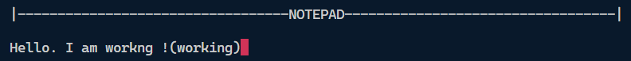

# Assignment 4
# NOTEPAD

## Overview
This is a console based notepad application that uses ncurses library to display the input text on the screen.

## Features
- Captures real-time user input without waiting for the "Enter" key.
- Displays the input characters on the terminal screen.
- Exits the program gracefully when the user presses the **ESC** key.
- Checks for each word in the dictionary and provides suggestions if the user types the word incorrectly.
- Provides facilities for saving and loading the text.

## Prerequisites
Before running the program, ensure that you have the `ncurses` library installed on your system.

### Installing `ncurses`
For **Debian/Ubuntu** systems, you can install it using:
```bash
sudo apt update
sudo apt install libncurses5-dev libncursesw5-dev
```

## How to Compile and Run
1. Save the program in a file named, for example, `notepad.cpp`.
2. Open a terminal and navigate to the directory where the file is saved using `cd` command.
3. Compile the program using:
    ```bash
    g++ -o main notepad.cpp -lncurses
    ```
4. Run the compiled program using:
    ```bash
    ./main
    ```

## How to Use the Program
- Upon running, the program will display console window with the title `NOTEPAD` on the top of the screen.
- Type any characters on the keyboard, and they will be printed on the terminal screen.
- The program continues to run until you press the **ESC** key (ASCII code `27`).
- Once **ESC** is pressed, the program exits gracefully, returning the terminal to its normal state.
- You can also use the `BACKSPACE` key to remove the last typed character.
- Press the `CTRL + S` key to save the text in a file named, `save.txt`.
- Press the `CTRL + L` key to load the text from any text file.

## Example Output
```
|----------------------------------NOTEPAD----------------------------------|

Hello! How are you?
```

## Output Screenshot

